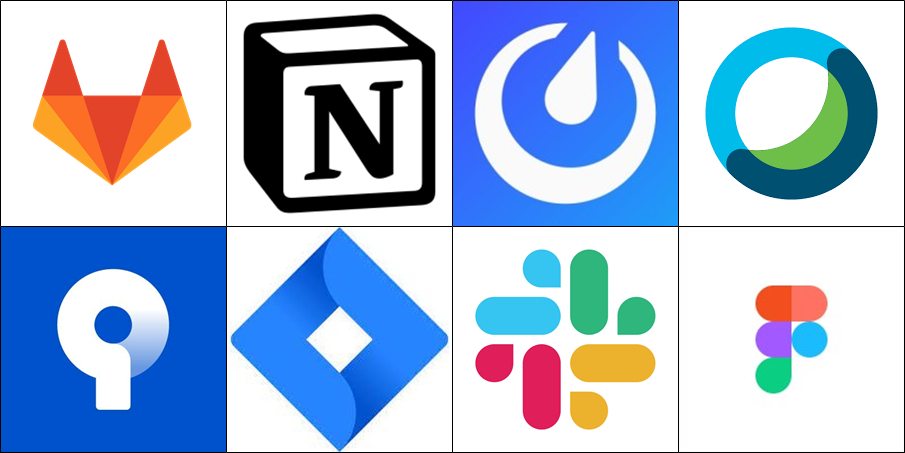
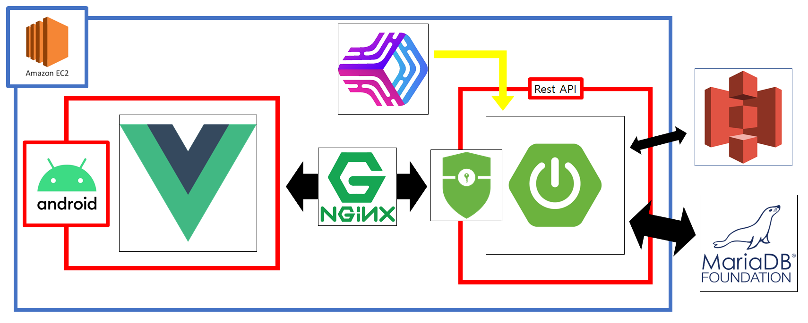
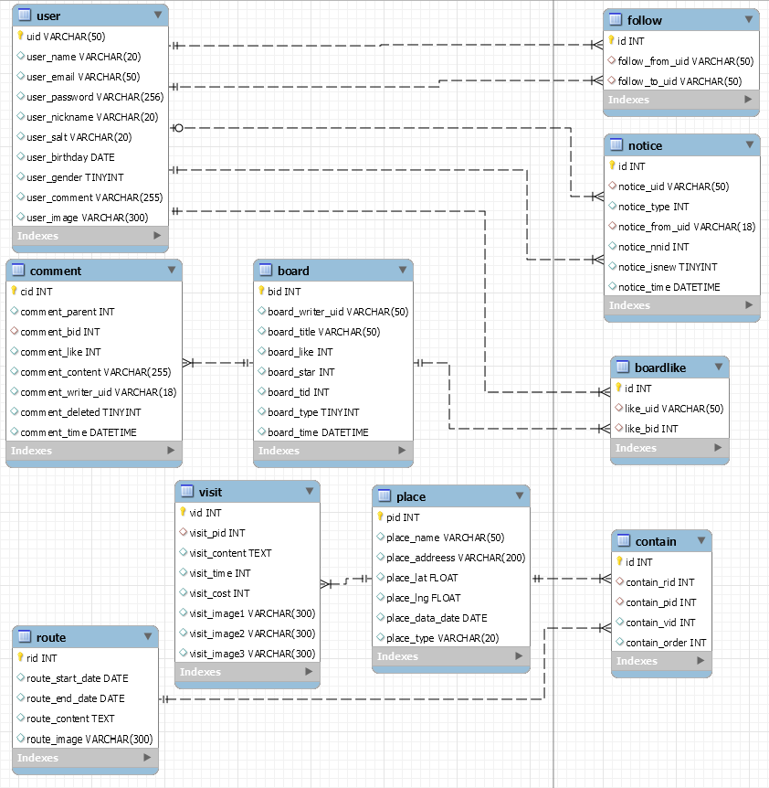

# [Course2go](http://i5a106.p.ssafy.io/)


> <b> 프로젝트 기간: 2021.07.12 ~ 2021.08.20 </b>


-20.04-orange>)


-yellow>)

## 서비스 개요

- <b> 여행 동선 공유를 위한 SNS 서비스 Course2go </b>
- Course2go는 다양한 여행자들의 여행동선을 공유하기 위한 SNS입니다

## 역할 분담

> Course2go developer

|                     **🙋 [이진호](https://github.com/jinho-pca)**                     |                  **🙋‍ [안기훈](https://github.com/KiHoonAhn1)**                   |          **🙋 [나희승](https://github.com/sjsjsjghkdwp)**           |                      **🙋‍ [조규홍](https://github.com/sitan516/)**                      |
| :-----------------------------------------------------------------------------------: | :----------------------------------------------------------------------: | :-----------------------------------------------------------------: | :-----------------------------------------------------------------------------: |
|                                                |                                   |                              |                                          |
|                                     백엔드 개발자                                     |                            프론트엔드 개발자                             |                            백엔드 개발자                            |                                  백엔드 개발자                                  |
| 유저 관리 <br /> AWS(EC2, S3) <br /> SpringBoot + (SMTP, Slack) <br /> 배포환경구축(NginX, PM2) <br />| 추가요함 <br /> 추가요함 <br />| 동선글, 방문글, 댓글 기능구현 <br /> 검색, 알림, 뉴스피드 기능구현 <br /> DB설계 및 관리 <br /> KakaoMap <br /> | Spring Security <br /> SNS 관련 기능 구현 <br /> 검색 기능 구현 <br />|
## 기획
* [와이어 프레임](https://www.figma.com/file/MliBKOTk3dwSKhyaA3d2QX/%EA%B3%B5%ED%86%B5%ED%94%84%EB%A1%9C%EC%A0%9D%ED%8A%B8?node-id=0%3A1)
* [기능 정의서](https://www.notion.so/5ed72c38a6ac4ed98a3b1613f12aa333?v=06ba98ba8e984949a3047d3bcaaf7aa3)

## 기술스택
#### 개발

#### 협업


## Architecture



## Git Convention
> [세부사항](https://www.notion.so/Git.md)

### 1. Commit types

- **init**: 새로운 프로젝트 초기 설정
- **feat**: 새로운 기능을 추가할 경우
- **fix**: 버그를 고친 경우
- **design**: CSS 등 디자인 변경
- **docs**: 문서를 수정한 경우 (제품 코드 수정 X)
- **rename:** 파일 혹은 폴더명을 수정하거나 옮기는 작업만인 경우
- **remove**: 파일을 삭제하는 작업만 수행한 경우sts

```bash
type: subject(제목)
docs: Update project Readme.md

body(본문)
프로젝트 markdown 파일 업데이트

footer(푸터)
Resolves: #231
```

### 2. Branch

- **feature**
  - feature/{분류}/{기능}
    - feature/fe/user_login
    - feature/be/social_login
- **fix**
  - fix/{분류}/{에러}
    - fix/fe/route_card
    - fix/be/board_delete
- **develop**
  - 이름 그대로 사용
- **master**
  - 이름 그대로 사용


## Front-end
* [세부사항](./frontend/README.md)
## Back-end
* [세부사항](./backend/README.md)

## Android

* [세부사항](./android/Readme.md)

#### DB - ERD



## Getting Started
* [시작하기](./documentation/markdown/GettingStarted.md)

## 참고자료

[UCC](./documentation/UCC/Course2go.mp4)
