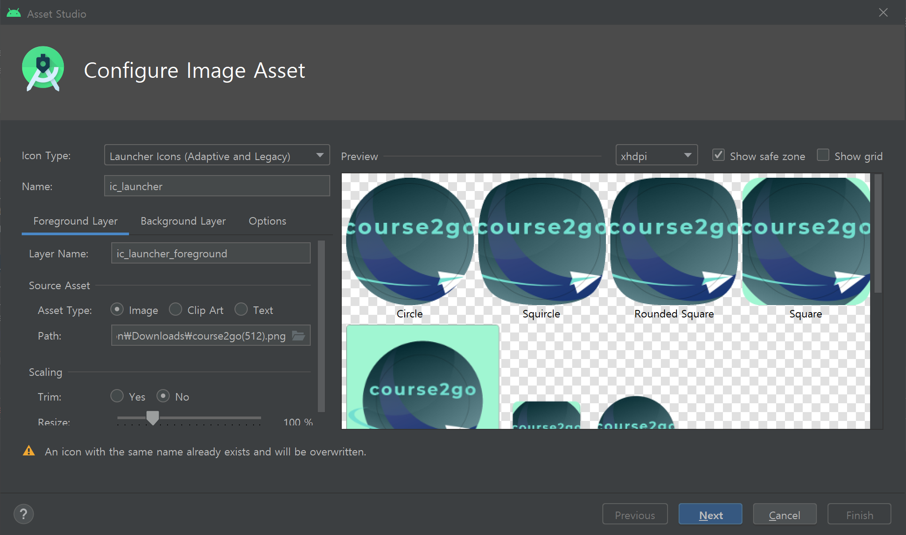
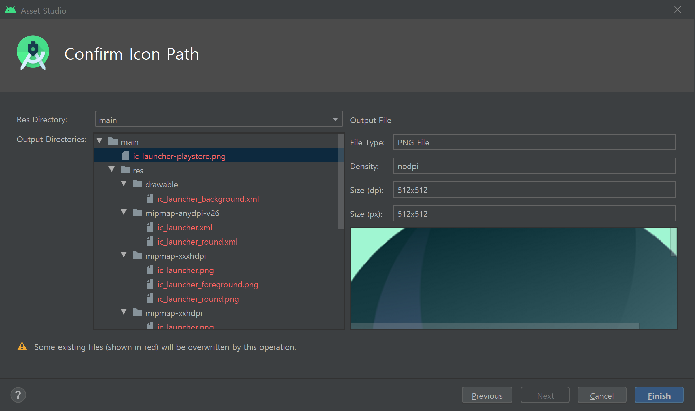
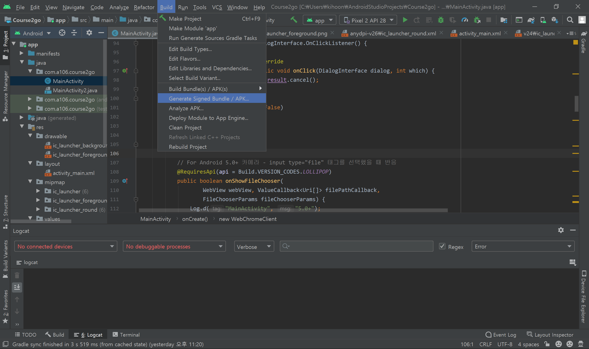
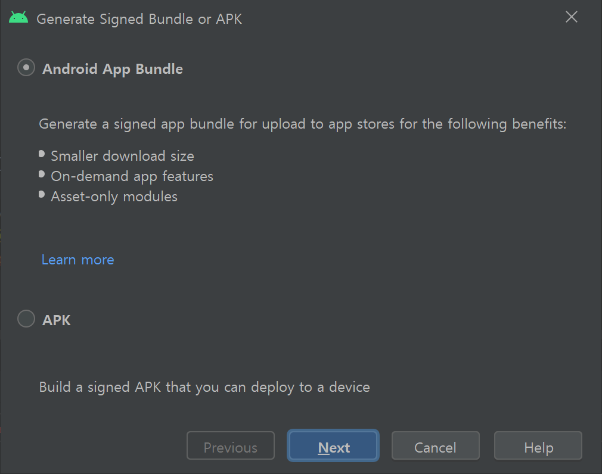
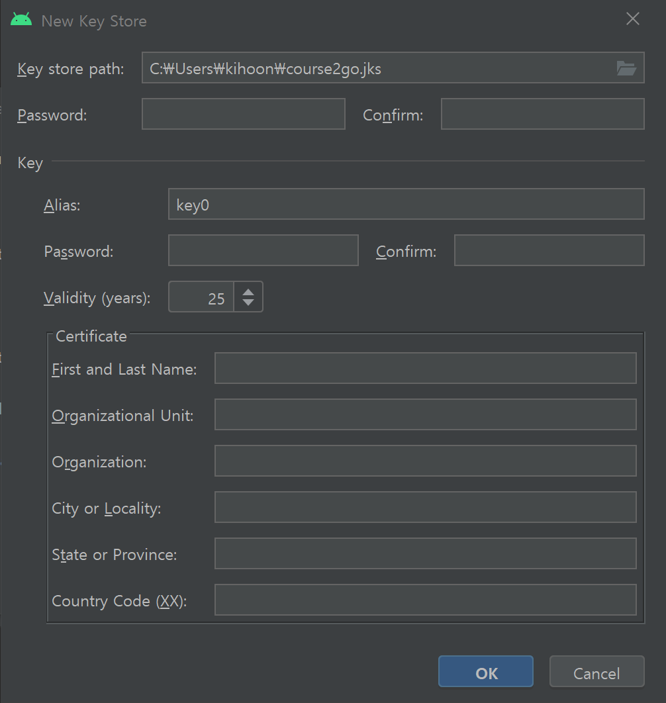
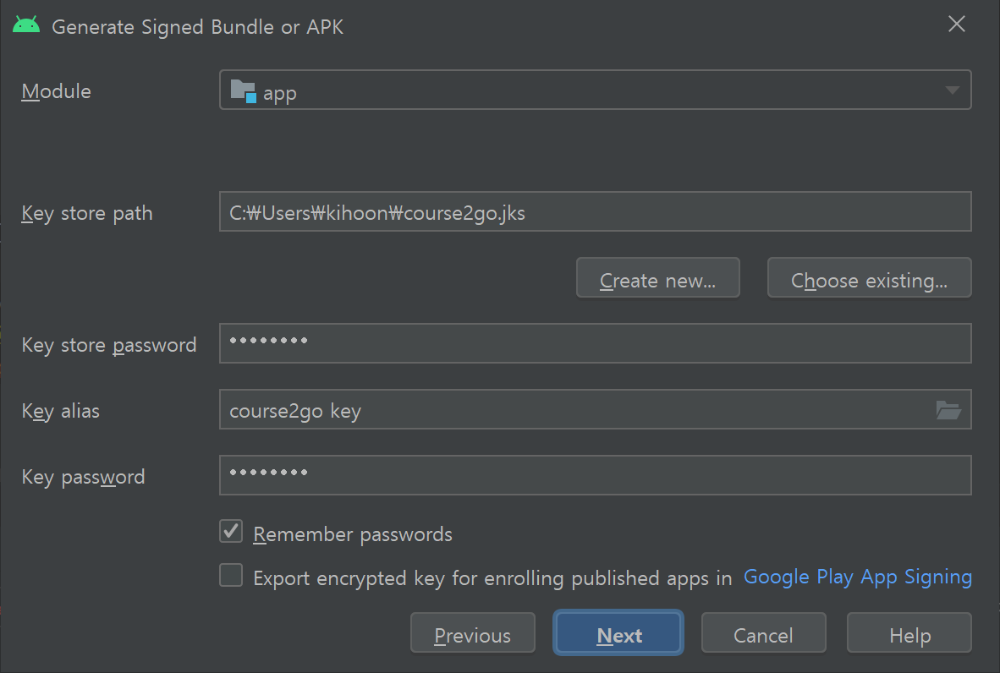
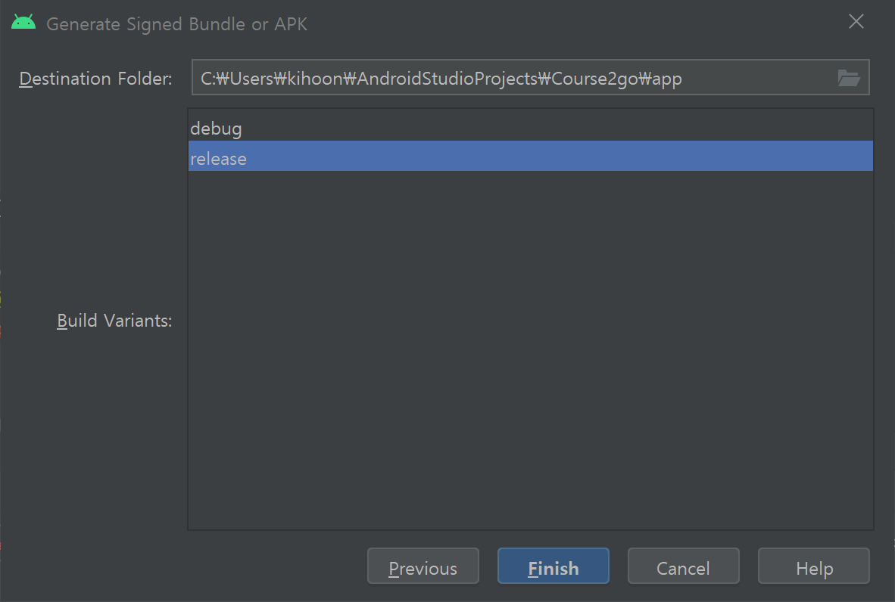

# Android WebView App

> Android 9.0(pie) 기준으로 작성되었습니다.


## 개발

### 화면 설정

* activity_main.xml


```xml
<?xml version="1.0" encoding="utf-8"?>
<androidx.constraintlayout.widget.ConstraintLayout xmlns:android="http://schemas.android.com/apk/res/android"
    xmlns:app="http://schemas.android.com/apk/res-auto"
    xmlns:tools="http://schemas.android.com/tools"
    android:layout_width="match_parent"
    android:layout_height="match_parent"
    android:visibility="visible"
    tools:context=".MainActivity"
    tools:visibility="visible">

    <WebView
        android:id="@+id/webView"
        android:layout_width="0dp"
        android:layout_height="0dp"
        android:visibility="visible"
        app:layout_constraintBottom_toBottomOf="parent"
        app:layout_constraintEnd_toEndOf="parent"
        app:layout_constraintStart_toStartOf="parent"
        app:layout_constraintTop_toTopOf="parent"
        tools:visibility="visible" />

</androidx.constraintlayout.widget.ConstraintLayout>
```


### 설정

#### AndroidManifest.xml

```xml
<?xml version="1.0" encoding="utf-8"?>
<manifest xmlns:android="http://schemas.android.com/apk/res/android"
    package="com.a106.course2go">

    <!-- 인터넷 사용 -->
    <uses-permission android:name="android.permission.INTERNET" />
    <uses-permission android:name="android.permission.ACCESS_NETWORK_STATE" />
	<!-- 카메라 하드웨어 사용 -->
    <uses-feature android:name="android.hardware.camera"
        android:required="false"/>
    <!-- 5.0(Lollipop) 버전 파일업로드 퍼미션 -->
    <uses-permission android:name="android.permission.READ_EXTERNAL_STORAGE" android:maxSdkVersion="18"/>
    <!-- 외부 저장소 사용 -->
    <uses-permission android:name="android.permission.WRITE_EXTERNAL_STORAGE" />

    <application
        android:allowBackup="true"
        android:icon="@mipmap/ic_launcher_foreground"
        android:label="@string/app_name"
        android:roundIcon="@mipmap/ic_launcher_round"
        android:supportsRtl="true"
        android:theme="@style/AppTheme"
        android:networkSecurityConfig="@xml/network_security_config"
        android:usesCleartextTraffic="true">
        <provider
            android:name="androidx.core.content.FileProvider"
            android:authorities="${applicationId}.fileprovider"
            android:exported="false"
            android:grantUriPermissions="true">
        <meta-data
            android:name="android.support.FILE_PROVIDER_PATHS"
            android:resource="@xml/file_paths" />
        </provider>
        <activity android:name="com.a106.course2go.MainActivity">
            <intent-filter>
                <action android:name="android.intent.action.MAIN" />

                <category android:name="android.intent.category.LAUNCHER" />
            </intent-filter>
        </activity>
    </application>

</manifest>
```


##### 참고사항

* ```xml
  <uses-permission android:name="android.permission.CAMERA" />
  ```

  * 이 부분을 넣는 경우에는 카메라가 정상적으로 작동되지 않음

* ```groovy
  <manifest xmlns:android="http://schemas.android.com/apk/res/android"
      package="com.a106.course2go">
  ```

  * PlayStore 출시를 위해서는 `com.example.course2go`에서 `com.*.course2go`로 변경해야 함


### Project Icon 변경

* `res`에서 `우클릭` 후 `New -> Image Asset` 클릭




* `Source Asset -> Path`에서 이미지 선택


* Size (dp)는 512x512 추천
* 확인 후 `Finish` 클릭 !
  * `res -> mipmap`에 있는 이미지들이 잘 변경되었나 확인




* 변경한 사진 적용

```groovy
android:icon="@mipmap/ic_launcher_foreground"
android:roundIcon="@mipmap/ic_launcher_round"
```

> 폴더 이름으로 설정(폴더 더블 클릭하면 이미지 나옴)
> 사진 이름이 변경되었다면 코드도 변경하자


### build.gradle (:app)

```groovy
apply plugin: 'com.android.application'

android {
    compileSdkVersion 30
    buildToolsVersion "30.0.2"

    defaultConfig {
        applicationId "com.a106.course2go"
        minSdkVersion 25
        targetSdkVersion 30
        versionCode 1
        versionName "1.0"

        testInstrumentationRunner "androidx.test.runner.AndroidJUnitRunner"
    }

    buildTypes {
        release {
            minifyEnabled false
            proguardFiles getDefaultProguardFile('proguard-android-optimize.txt'), 'proguard-rules.pro'
        }
    }
}

dependencies {
    implementation fileTree(dir: "libs", include: ["*.jar"])
    implementation 'androidx.appcompat:appcompat:1.2.0'
    implementation 'androidx.constraintlayout:constraintlayout:2.0.4'
    testImplementation 'junit:junit:4.12'
    androidTestImplementation 'androidx.test.ext:junit:1.1.2'
    androidTestImplementation 'androidx.test.espresso:espresso-core:3.3.0'
}
```


#### 주의사항

* 코드 수정 후 플레이스토어에 새로운 버전으로 업데이트하는 경우 버전을 이전보다 하나씩 올려야 한다.

  ```groovy
  versionCode 1
  versionName "1.0"
  ```

* 프로젝트 패키지명 변경 후에는 `defaultConfig > applicationId` 확인


### res/xml

> res 밑에 xml 폴더를 만들어 `file_paths.xml`과 `network_security_config.xml` 파일 생성 후 아래 코드 추가

* file_paths.xml

```xml
<?xml version="1.0" encoding="utf-8"?>
<paths xmlns:android="http://schemas.android.com/apk/res/android">
    <files-path name="files" path="/" />
</paths>
```


* network_security_config.xml

```xml
<?xml version="1.0" encoding="utf-8"?>
<network-security-config>
    <base-config cleartextTrafficPermitted="true"/>
</network-security-config>
```


### res/values/styles.xml

> 상단 title bar를 삭제하기 위해 아래 두 줄 추가
>
> `AndroidManifest.xml`에서도 작업을 수행할 수 있지만 특정 상황에서 생길 수 있는 오류를 방지하기 위해 `styles.xml`에 작업

```xml
<resources>
    <!-- Base application theme. -->
    <style name="AppTheme" parent="Theme.AppCompat.Light.DarkActionBar">
        <!-- Customize your theme here. -->
        <item name="colorPrimary">@color/colorPrimary</item>
        <item name="colorPrimaryDark">@color/colorPrimaryDark</item>
        <item name="colorAccent">@color/colorAccent</item>
        <!-- 상단 title bar -->
        <item name="windowActionBar">false</item>
        <item name="windowNoTitle">true</item>
    </style>
</resources>
```


### MainActivity

```java
package com.a106.course2go;

import androidx.annotation.NonNull;
import androidx.annotation.RequiresApi;
import androidx.appcompat.app.AlertDialog;
import androidx.appcompat.app.AppCompatActivity;
import androidx.core.content.FileProvider;

import android.Manifest;
import android.annotation.TargetApi;
import android.content.DialogInterface;
import android.content.Intent;
import android.content.pm.PackageManager;
import android.net.Uri;
import android.os.Build;
import android.os.Bundle;
import android.os.Parcelable;
import android.provider.MediaStore;
import android.provider.Settings;
import android.util.Log;
import android.webkit.JsResult;
import android.webkit.ValueCallback;
import android.webkit.WebChromeClient;
import android.webkit.WebSettings;
import android.webkit.WebView;
import android.webkit.WebViewClient;
import android.widget.Toast;

import java.io.File;

public class MainActivity extends AppCompatActivity {
    private WebView webView;
    private long pressedTime;

    public ValueCallback<Uri> filePathCallbackNormal;
    public ValueCallback<Uri[]> filePathCallbackLollipop;
    public final static int FILECHOOSER_NORMAL_REQ_CODE = 2001;
    public final static int FILECHOOSER_LOLLIPOP_REQ_CODE = 2002;
    private Uri cameraImageUri = null;

    @Override
    protected void onCreate(Bundle savedInstanceState) {
        super.onCreate(savedInstanceState);
        setContentView(R.layout.activity_main);

        webView = findViewById(R.id.webView);

        WebSettings webSettings = webView.getSettings();
        // JavaScript
        webSettings.setJavaScriptEnabled(true);
        // LocalStorage
        webSettings.setDomStorageEnabled(true);
        webSettings.setJavaScriptCanOpenWindowsAutomatically(true);

        checkVerify();

        webView.setWebViewClient(new WebViewClient());

        webView.setWebChromeClient(new WebChromeClient() {
            //
            //웹뷰에 alert창에 url을 제거한다.
            //
            public boolean onJsAlert(WebView view, String url, String message,
                                     final android.webkit.JsResult result) {
                new AlertDialog.Builder(MainActivity.this)
                        .setTitle("")
                        .setMessage(message)
                        .setPositiveButton(android.R.string.ok,
                                new AlertDialog.OnClickListener() {
                                    public void onClick(DialogInterface dialog, int which) {
                                        result.confirm();
                                    }
                                })
                        .setCancelable(false)
                        .create()
                        .show();
                return true;
            }
            
			//
            //웹뷰에 Confirm창에 url을 제거한다.
            //
            @Override
            public boolean onJsConfirm(WebView view, String url,
                                       String message, final JsResult result) {

                new AlertDialog.Builder(MainActivity.this)
                        .setTitle("")
                        .setMessage(message)
                        .setPositiveButton(android.R.string.ok,
                                new DialogInterface.OnClickListener() {

                                    public void onClick(DialogInterface dialog, int which) {
                                        result.confirm();
                                    }
                                })
                        .setNegativeButton(android.R.string.cancel,
                                new DialogInterface.OnClickListener() {

                                    @Override
                                    public void onClick(DialogInterface dialog, int which) {
                                        result.cancel();
                                    }
                                })
                        .setCancelable(false)
                        .create()
                        .show();
                return true;
            }
            
			//
            // For Android 5.0+ 카메라 - input type="file" 태그를 선택했을 때 반응
            //
            @RequiresApi(api = Build.VERSION_CODES.LOLLIPOP)
            public boolean onShowFileChooser(
                    WebView webView, ValueCallback<Uri[]> filePathCallback,
                    FileChooserParams fileChooserParams) {
                Log.d("MainActivity", "5.0+");

                // Callback 초기화 (중요!)
                if (filePathCallbackLollipop != null) {
                    filePathCallbackLollipop.onReceiveValue(null);
                    filePathCallbackLollipop = null;
                }
                filePathCallbackLollipop = filePathCallback;

                boolean isCapture = fileChooserParams.isCaptureEnabled();
                runCamera(isCapture);
                return true;
            }

        });

        webView.loadUrl("http://192.168.25.62:3000/");
    }
    
	//
    // 닫기 전 물어보기
    // 일단 뉴스피드에서는 무조건 가능하게 해놨음. 다른 프로젝트에 사용 시 이 부분 수정 필요
   	//
    @Override
    public void onBackPressed() {
        if (webView.getUrl().equalsIgnoreCase("https://i5a106.p.ssafy.io/newsfeed") ||
                webView.getUrl().equalsIgnoreCase("https://i5a106.p.ssafy.io/")) {
            if (pressedTime == 0) {
                Toast.makeText(MainActivity.this, "한번 더 누르시면 종료됩니다.", Toast.LENGTH_SHORT).show();
                pressedTime = System.currentTimeMillis();
            } else {
                int seconds = (int) (System.currentTimeMillis() - pressedTime);

                if (seconds > 2000) {
                    pressedTime = 0;
                } else {
                    finish();
                }
            }
        } else if (webView.canGoBack()) {
            webView.goBack();
        }
    }
    
	//
    //권한 획득 여부 확인
    //
    @TargetApi(Build.VERSION_CODES.M)
    public void checkVerify() {

        if (checkSelfPermission(Manifest.permission.INTERNET) != PackageManager.PERMISSION_GRANTED ||
                checkSelfPermission(Manifest.permission.ACCESS_NETWORK_STATE) != PackageManager.PERMISSION_GRANTED ||
                checkSelfPermission(Manifest.permission.CAMERA) != PackageManager.PERMISSION_GRANTED ||
                checkSelfPermission(Manifest.permission.WRITE_EXTERNAL_STORAGE) != PackageManager.PERMISSION_GRANTED ||
                checkSelfPermission(Manifest.permission.READ_EXTERNAL_STORAGE) != PackageManager.PERMISSION_GRANTED) {
            //카메라 또는 저장공간 권한 획득 여부 확인
            if (shouldShowRequestPermissionRationale(Manifest.permission.WRITE_EXTERNAL_STORAGE) || shouldShowRequestPermissionRationale(Manifest.permission.CAMERA)) {
                // 카메라 및 저장공간 권한 요청
                requestPermissions(new String[]{Manifest.permission.INTERNET, Manifest.permission.CAMERA,
                        Manifest.permission.ACCESS_NETWORK_STATE,
                        Manifest.permission.WRITE_EXTERNAL_STORAGE, Manifest.permission.READ_EXTERNAL_STORAGE}, 1);
            } else {
                
            }
        }
    }
    
	//
    //권한 획득 여부에 따른 결과 반환
    //
    @Override
    public void onRequestPermissionsResult(int requestCode, @NonNull String[] permissions, @NonNull int[] grantResults) {
        super.onRequestPermissionsResult(requestCode, permissions, grantResults);

        if (requestCode == 1) {
            if (grantResults.length > 0) {
                for (int i = 0; i < grantResults.length; ++i) {
                    if (grantResults[i] == PackageManager.PERMISSION_DENIED) {
                        // 카메라, 저장소 중 하나라도 거부한다면 앱실행 불가 메세지 띄움
                        new AlertDialog.Builder(this).setTitle("알림").setMessage("권한을 허용해주셔야 앱을 이용할 수 있습니다.")
                                .setPositiveButton("종료", new DialogInterface.OnClickListener() {
                                    public void onClick(DialogInterface dialog, int which) {
                                        dialog.dismiss();
                                        finish();
                                    }
                                }).setNegativeButton("권한 설정", new DialogInterface.OnClickListener() {
                            public void onClick(DialogInterface dialog, int which) {
                                dialog.dismiss();
                                Intent intent = new Intent(Settings.ACTION_APPLICATION_DETAILS_SETTINGS)
                                        .setData(Uri.parse("package:" + getApplicationContext().getPackageName()));
                                getApplicationContext().startActivity(intent);
                            }
                        }).setCancelable(false).show();

                        return;
                    }
                }
                Toast.makeText(this, "Succeed Read/Write external storage !", Toast.LENGTH_SHORT).show();
            }
        }
    }
    
	//
    //액티비티가 종료될 때 결과를 받고 파일을 전송할 때 사용
    //
    @TargetApi(Build.VERSION_CODES.LOLLIPOP)
    @Override
    protected void onActivityResult(int requestCode, int resultCode, Intent data) {

        switch (requestCode) {
            case FILECHOOSER_NORMAL_REQ_CODE:
                if (resultCode == RESULT_OK) {
                    if (filePathCallbackNormal == null) return;
                    Uri result = (data == null || resultCode != RESULT_OK) ? null : data.getData();
                    //  onReceiveValue 로 파일을 전송한다.
                    filePathCallbackNormal.onReceiveValue(result);
                    filePathCallbackNormal = null;
                }
                break;
            case FILECHOOSER_LOLLIPOP_REQ_CODE:
                if (resultCode == RESULT_OK) {
                    if (filePathCallbackLollipop == null) return;
                    if (data == null)
                        data = new Intent();
                    if (data.getData() == null)
                        data.setData(cameraImageUri);

                    filePathCallbackLollipop.onReceiveValue(WebChromeClient.FileChooserParams.parseResult(resultCode, data));
                    filePathCallbackLollipop = null;
                } else {
                    if (filePathCallbackLollipop != null) {   //  resultCode에 RESULT_OK가 들어오지 않으면 null 처리하지 한다.(이렇게 하지 않으면 다음부터 input 태그를 클릭해도 반응하지 않음)
                        filePathCallbackLollipop.onReceiveValue(null);
                        filePathCallbackLollipop = null;
                    }

                    if (filePathCallbackNormal != null) {
                        filePathCallbackNormal.onReceiveValue(null);
                        filePathCallbackNormal = null;
                    }
                }
                break;
            default:

                break;
        }

        super.onActivityResult(requestCode, resultCode, data);
    }

	//
    // 카메라 기능 구현
    //
    private void runCamera(boolean _isCapture) {
        Intent intentCamera = new Intent(MediaStore.ACTION_IMAGE_CAPTURE);
//        intentCamera.setFlags(Intent.FLAG_ACTIVITY_NEW_TASK);
        File path = getFilesDir();
        File file = new File(path, "picture.png"); // sample.png 는 카메라로 찍었을 때 저장될 파일명이므로 사용자 마음대로
        // File 객체의 URI 를 얻는다.
        if (Build.VERSION.SDK_INT >= Build.VERSION_CODES.N) {
            String strpa = getApplicationContext().getPackageName();
            cameraImageUri = FileProvider.getUriForFile(this, strpa + ".fileprovider", file);
        } else {
            cameraImageUri = Uri.fromFile(file);
        }
        intentCamera.putExtra(MediaStore.EXTRA_OUTPUT, cameraImageUri);

        if (!_isCapture) { // 선택팝업 카메라, 갤러리 둘다 띄우고 싶을 때
            Intent pickIntent = new Intent(Intent.ACTION_PICK);
            pickIntent.setType(MediaStore.Images.Media.CONTENT_TYPE);
            pickIntent.setData(MediaStore.Images.Media.EXTERNAL_CONTENT_URI);

            String pickTitle = "사진 가져올 방법을 선택하세요.";
            Intent chooserIntent = Intent.createChooser(pickIntent, pickTitle);

            // 카메라 intent 포함시키기..
            chooserIntent.putExtra(Intent.EXTRA_INITIAL_INTENTS, new Parcelable[]{intentCamera});
            startActivityForResult(chooserIntent, FILECHOOSER_LOLLIPOP_REQ_CODE);
        } else {// 바로 카메라 실행..
            startActivityForResult(intentCamera, FILECHOOSER_LOLLIPOP_REQ_CODE);
        }
    }
}
```


## Build

* `Build -> Generate Signed Bundle / APK` 클릭




* Android App Bundle 선택

> 2021년 8월부터 AAB(Android App Bundle)로 출시하게도록 바뀜




* key 생성 (Next 클릭 후 `Create new` 버튼으로 이동)



> 한번 build하면 자동 저장되어 다음에 다시 입력하지 않고 사용 가능하지만 나중을 위해 `Key Store Path`와 `Password`는 잊어버리지 않게 적어둔다
>
> `Alias`는 원하는 대로 이름 입력.
> `Password`도 원하는 대로 만들면 되지만 잊어버리지 않도록 위와 똑같이 설정해주면 편하다.
> `Validity`도 원하는 만큼 입력
>
> `Certificate` 안의 내용 중 해당되는 내용은 모두 작성하자


* key 입력



> 위에서 작성한 정보를 입력한다.
>
> App을 처음 빌드하는 경우에는 아래 체크박스도 체크해주자
>
> 완료가 되었다면 `Next`


* Build aab file



> 처음 release하는 것이므로 release를 선택하고 `Finish`를 클릭하면 일정 시간 경과 후 작업이 완료된다
>
> 오른쪽 아래에 뜨는 알림을 클릭해서 폴더로 이동하면 `app-release.aab` 파일을 볼 수 있는데 이 파일을 PlayStore에서 출시할 때 첨부해주면 된다


## PlayStore 개발자 등록

> 등록 과정이 복잡하고, 이미 등록을 완료했기 때문에 링크로 첨부

[App Release](https://wp.swing2app.co.kr/knowledgebase/playstore-apprelease/) 링크와 [App Upload](https://wp.swing2app.co.kr/documentation/appmanage/version/playstore-upload/) 링크를 참고하여 진행하면 개발자 등록이 가능하다.
