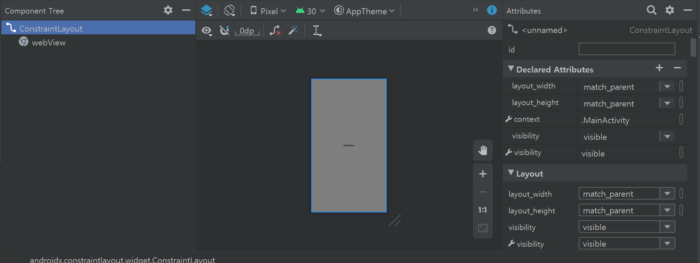

# Android WebView App

> Android 9.0(pie) 기준으로 작성되었습니다.


## 화면 설정

* activity_main.xml



```xml
<?xml version="1.0" encoding="utf-8"?>
<androidx.constraintlayout.widget.ConstraintLayout xmlns:android="http://schemas.android.com/apk/res/android"
    xmlns:app="http://schemas.android.com/apk/res-auto"
    xmlns:tools="http://schemas.android.com/tools"
    android:layout_width="match_parent"
    android:layout_height="match_parent"
    android:visibility="visible"
    tools:context=".MainActivity"
    tools:visibility="visible">

    <WebView
        android:id="@+id/webView"
        android:layout_width="0dp"
        android:layout_height="0dp"
        android:visibility="visible"
        app:layout_constraintBottom_toBottomOf="parent"
        app:layout_constraintEnd_toEndOf="parent"
        app:layout_constraintStart_toStartOf="parent"
        app:layout_constraintTop_toTopOf="parent"
        tools:visibility="visible" />

</androidx.constraintlayout.widget.ConstraintLayout>
```


## 설정

### AndroidManifest.xml

```xml
<?xml version="1.0" encoding="utf-8"?>
<manifest xmlns:android="http://schemas.android.com/apk/res/android"
    package="com.a106.course2go">

    <!-- 인터넷 사용 -->
    <uses-permission android:name="android.permission.INTERNET" />
    <uses-permission android:name="android.permission.ACCESS_NETWORK_STATE" />
	<!-- 카메라 하드웨어 사용 -->
    <uses-feature android:name="android.hardware.camera"
        android:required="false"/>
    <!-- 5.0(Lollipop) 버전 파일업로드 퍼미션 -->
    <uses-permission android:name="android.permission.READ_EXTERNAL_STORAGE" android:maxSdkVersion="18"/>
    <!-- 외부 저장소 사용 -->
    <uses-permission android:name="android.permission.WRITE_EXTERNAL_STORAGE" />

    <application
        android:allowBackup="true"
        android:icon="@mipmap/ic_launcher_foreground"
        android:label="@string/app_name"
        android:roundIcon="@mipmap/ic_launcher_round"
        android:supportsRtl="true"
        android:theme="@style/AppTheme"
        android:networkSecurityConfig="@xml/network_security_config"
        android:usesCleartextTraffic="true">
        <provider
            android:name="androidx.core.content.FileProvider"
            android:authorities="${applicationId}.fileprovider"
            android:exported="false"
            android:grantUriPermissions="true">
        <meta-data
            android:name="android.support.FILE_PROVIDER_PATHS"
            android:resource="@xml/file_paths" />
        </provider>
        <activity android:name="com.a106.course2go.MainActivity">
            <intent-filter>
                <action android:name="android.intent.action.MAIN" />

                <category android:name="android.intent.category.LAUNCHER" />
            </intent-filter>
        </activity>
    </application>

</manifest>
```


#### 참고사항

* ```xml
  <uses-permission android:name="android.permission.CAMERA" />
  ```

  * 이 부분을 넣는 경우에는 카메라가 정상적으로 작동되지 않음

* ```groovy
  <manifest xmlns:android="http://schemas.android.com/apk/res/android"
      package="com.a106.course2go">
  ```

  * PlayStore 출시를 위해서는 `com.example.course2go`에서 `com.*.course2go`로 변경해야 함


### build.gradle (:app)

```groovy
apply plugin: 'com.android.application'

android {
    compileSdkVersion 30
    buildToolsVersion "30.0.2"

    defaultConfig {
        applicationId "com.a106.course2go"
        minSdkVersion 25
        targetSdkVersion 30
        versionCode 5
        versionName "5.0"

        testInstrumentationRunner "androidx.test.runner.AndroidJUnitRunner"
    }

    buildTypes {
        release {
            minifyEnabled false
            proguardFiles getDefaultProguardFile('proguard-android-optimize.txt'), 'proguard-rules.pro'
        }
    }
}

dependencies {
    implementation fileTree(dir: "libs", include: ["*.jar"])
    implementation 'androidx.appcompat:appcompat:1.2.0'
    implementation 'androidx.constraintlayout:constraintlayout:2.0.4'
    testImplementation 'junit:junit:4.12'
    androidTestImplementation 'androidx.test.ext:junit:1.1.2'
    androidTestImplementation 'androidx.test.espresso:espresso-core:3.3.0'
}
```


#### 주의사항

* 코드 수정 후 플레이스토어에 새로운 버전으로 업데이트하는 경우 버전을 이전보다 하나씩 올려야 한다.

  ```groovy
      versionCode 5
      versionName "5.0"
  ```

* 프로젝트 패키지명 변경 후에는 `defaultConfig > applicationId` 확인


### res/xml

> res 밑에 xml 폴더를 만들어 `file_paths.xml`과 `network_security_config.xml` 파일 생성 후 아래 코드 추가

* file_paths.xml

```xml
<?xml version="1.0" encoding="utf-8"?>
<paths xmlns:android="http://schemas.android.com/apk/res/android">
    <files-path name="files" path="/" />
</paths>
```


* network_security_config.xml

```xml
<?xml version="1.0" encoding="utf-8"?>
<network-security-config>
    <base-config cleartextTrafficPermitted="true"/>
</network-security-config>
```


### res/values/styles.xml

> 상단 title bar를 삭제하기 위해 아래 두 줄 추가
>
> `AndroidManifest.xml`에서도 작업을 수행할 수 있지만 특정 상황에서 생길 수 있는 오류를 방지하기 위해 `styles.xml`에 작업

```xml
<resources>
    <!-- Base application theme. -->
    <style name="AppTheme" parent="Theme.AppCompat.Light.DarkActionBar">
        <!-- Customize your theme here. -->
        <item name="colorPrimary">@color/colorPrimary</item>
        <item name="colorPrimaryDark">@color/colorPrimaryDark</item>
        <item name="colorAccent">@color/colorAccent</item>
        <!-- 상단 title bar -->
        <item name="windowActionBar">false</item>
        <item name="windowNoTitle">true</item>
    </style>
</resources>
```
