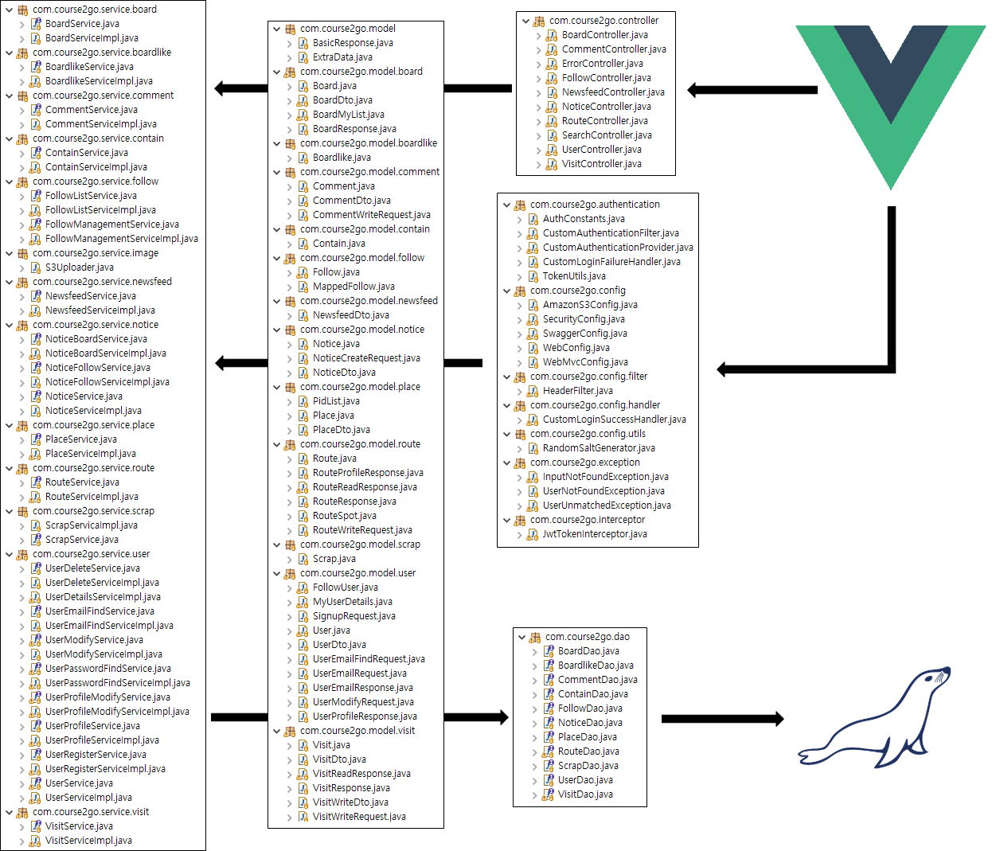

# Backend

## JWT


(출처: https://springbootdev.com/)

최초 로그인 시 위와같은 Architecture에 따라 발급되고 사용자의 LocalStorage에 저장하여 사용한다.

Architecture는 다음과 같은 절차를 따른다.

1. course2go/user/login 으로 email과 비밀번호를 정보로 담아 요청을 보낸다. 이 요청은 CustomAuthenticationFilter에 의해 처리된다.

2. CustomAuthenticationFilter는 해당 정보를 바탕으로 UsernamePasswordAuthenticationToken을 생성한다.

3. AuthenticationManager는 CustomAuthenticationProvider를 통해서 UsernamePasswordAuthenticationToken에 있는 정보가 유저 정보에 있는지 확인한다. 

4. 정보의 유무에 따라 CustomAuthenticationFilter 는 successfulAuthentication() 혹은 unsuccessfulAuthentication() 메서드가 실행된다.

5. 성공시 SuccessHandler에 의해서 Token이 생성되고 Response Header에 JWT token을 담아 보낸다.


로그인 후 사용자가 본인인증이 필요한 API 요청을 보낼 때는 Header에 JWT token이 포함되어 있어야한다. 


## JPA

## Dependancy
* swagger
```
<dependency>
    <groupId>io.springfox</groupId>
    <artifactId>springfox-swagger2</artifactId>
    <version>2.9.2</version>
</dependency>
<dependency>
    <groupId>io.springfox</groupId>
    <artifactId>springfox-swagger-ui</artifactId>
    <version>2.6.1</version>
</dependency>
```
* hibernate
```
<dependency>
    <groupId>javax.validation</groupId>
    <artifactId>validation-api</artifactId>
    <version>2.0.1.Final</version>
</dependency>
<dependency>
    <groupId>org.hibernate.validator</groupId>
    <artifactId>hibernate-validator</artifactId>
    <version>6.0.1.Final</version>
</dependency>
```
* jwt
```
<dependency>
    <groupId>io.jsonwebtoken</groupId>
    <artifactId>jjwt</artifactId>
    <version>0.9.1</version>
</dependency>
```
* mariaDB
```
<dependency>
    <groupId>org.springframework.boot</groupId>
    <artifactId>spring-boot-starter-jdbc</artifactId>
</dependency>
<dependency>
    <groupId>org.mariadb.jdbc</groupId>
    <artifactId>mariadb-java-client</artifactId>
    <scope>runtime</scope>
</dependency>
```
* lombok
```
<dependency>
    <groupId>org.projectlombok</groupId>
    <artifactId>lombok</artifactId>
    <optional>true</optional>
</dependency>
```
* modelmapper
```
<dependency>
    <groupId>org.modelmapper</groupId>
    <artifactId>modelmapper</artifactId>
    <version>2.3.8</version>
</dependency>
```
* slack
```
<dependency>
    <groupId>com.github.maricn</groupId>
    <artifactId>logback-slack-appender</artifactId>
    <version>1.4.0</version>
</dependency>
```
* aws
```
<dependency>
    <groupId>com.amazonaws</groupId>
    <artifactId>aws-java-sdk-s3</artifactId>
    <version>1.12.25</version>
</dependency>
<dependency>
    <groupId>org.springframework.cloud</groupId>
    <artifactId>spring-cloud-starter-aws</artifactId>
    <version>2.0.1.RELEASE</version>
</dependency>
<dependency>
    <groupId>org.springframework.cloud</groupId>
    <artifactId>spring-cloud-aws-context</artifactId>
    <version>1.2.1.RELEASE</version>
</dependency>
<dependency>
    <groupId>org.springframework.cloud</groupId>
    <artifactId>spring-cloud-aws-autoconfigure</artifactId>
    <version>1.2.1.RELEASE</version>
</dependency>
```
* email
```
<dependency>
    <groupId>org.springframework.boot</groupId>
    <artifactId>spring-boot-starter-mail</artifactId>
    <version>2.0.1.RELEASE</version>
</dependency>
```
## MVC design

### model
* Entity의 경우 getter는 선언하되 setter는 선언하지 않는다. create를 위한 생성의 경우 builder를 사용하도록 한다.
* Entity는 해당 entity의 DB의 데이터를 Dao(JPARepository)에서 받아와 Service로 보낼때 혹은 그 반대의 경우에만 사용한다.

### Service
* 실질적인 logic이 구현되는 곳

### controller
* 권한 확인, S3 호출, Service 호출, 예외처리를 진행한다.
* RequestMapping 어노테이션을 잘 구분해서 사용하도록 한다.
    * Get 방식의 경우 동일한 입력으로 연속해서 호출할 경우 캐싱된 데이터를 사용하므로 데이터에 변화를 주는 경우 사용하지 않아야 한다.

### Back-end logic 흐름도

