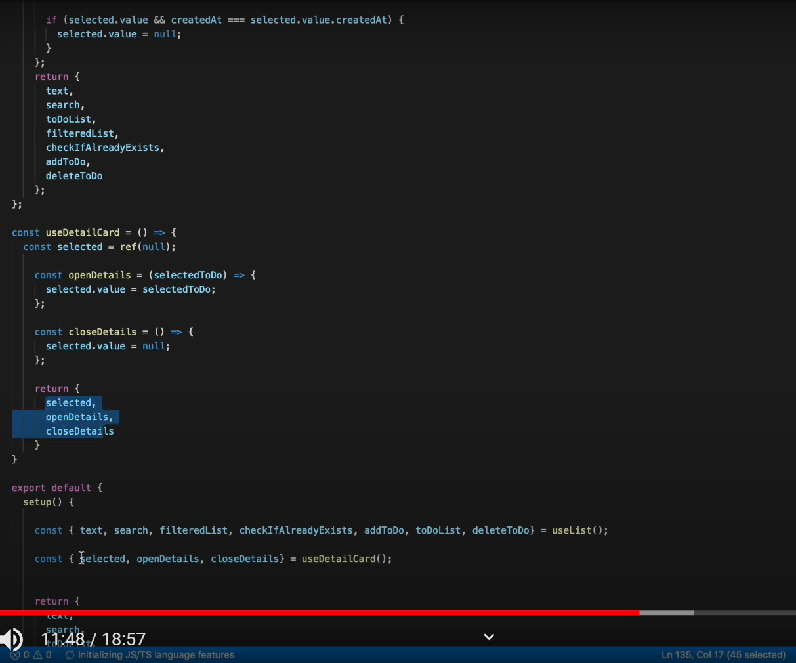

# frontend

## Project setup
```
yarn install
```

### Compiles and hot-reloads for development
```
yarn serve
```

### Compiles and minifies for production
```
yarn build
```

### Lints and fixes files
```
yarn lint
```

### Customize configuration
See [Configuration Reference](https://cli.vuejs.org/config/).


## Project Settings

### add Vuex

```bash
$ vue add vuex
```


### add Router

```bash
$ vue add router

 WARN  There are uncommitted changes in the current repository, it's recommended to commit or stash them first.
? Still proceed?
Y

? Use history mode for router? (Requires proper server setup for index fallback in production)
Y
```


### Settings

```bash
$ yarn add axios # npm install axios
$ yarn add password-validator # npm install password-validator
$ yarn add email-validator # npm install email-validator
```


### Run Server

```bash
# 포트 변경을 위해서는 yarn 필요
$ yarn server --port 3000
```


## Router

### 0. Getting Started

* App.vue

```html
<div id="app">
  <h1>Hello App!</h1>
  <p>
    <!-- use the router-link component for navigation. -->
    <!-- specify the link by passing the `to` prop. -->
    <!-- `<router-link>` will render an `<a>` tag with the correct `href` attribute -->
    <router-link to="/">Go to Home</router-link>
    <router-link to="/about">Go to About</router-link>
  </p>
  <!-- route outlet -->
  <!-- component matched by the route will render here -->
  <router-view></router-view>
</div>
```

* router/index.js + main.js

```js
// 1. Define route components.
// These can be imported from other files
const Home = { template: '<div>Home</div>' }
const About = { template: '<div>About</div>' }

// 2. Define some routes
// Each route should map to a component.
// We'll talk about nested routes later.
const routes = [
  { path: '/', component: Home },
  { path: '/about', component: About },
]

// 3. Create the router instance and pass the `routes` option
// You can pass in additional options here, but let's
// keep it simple for now.
const router = VueRouter.createRouter({
  // 4. Provide the history implementation to use. We are using the hash history for simplicity here.
  history: VueRouter.createWebHashHistory(),
  routes, // short for `routes: routes`
})

// 5. Create and mount the root instance.
const app = Vue.createApp({})
// Make sure to _use_ the router instance to make the
// whole app router-aware.
app.use(router)

app.mount('#app')

// Now the app has started!
```


* Home.vue에서 `this.$router.push()` 사용

```javascript
// Home.vue
export default {
  computed: {
    username() {
      // We will see what `params` is shortly
      return this.$route.params.username
    },
  },
  methods: {
    goToDashboard() {
      if (isAuthenticated) {
        this.$router.push('/dashboard')
      } else {
        this.$router.push('/login')
      }
    },
  },
}
```


### 1. Dynamic Route Matching

#### Params를 이용한 Dynamic Route Matching

```js
const User = {
  template: '<div>User {{ $route.params.id }}</div>',
}

const routes = [
  // dynamic segments start with a colon
  { path: '/users/:id', component: User },
]
```


| pattern                        | matched path             | $route.params                            |
| ------------------------------ | ------------------------ | ---------------------------------------- |
| /users/:username               | /users/eduardo           | `{ username: 'eduardo' }`                |
| /users/:username/posts/:postId | /users/eduardo/posts/123 | `{ username: 'eduardo', postId: '123' }` |


##### 작동 데모

* App.vue

```vue
<template>
  <ul>
    <li>
      <router-link to="/users/eduardo/posts/1"
        >/users/eduardo/posts/1</router-link
      >
    </li>
    <li>
      <router-link to="/users/eduardo/posts/20"
        >/users/eduardo/posts/20</router-link
      >
    </li>
  </ul>
  <router-view></router-view>
</template>

<script>
export default {
  name: "App",
};
</script>

<style>

</style>
```


* router.js

```js
import { createRouter, createWebHistory } from 'vue-router'
import UserPost from './views/UserPost.vue'

export const router = createRouter({
  history: createWebHistory(),
  routes: [{ path: '/users/:username/posts/:postId', component: UserPost }],
})
```


* UserPost.vue

```vue
<template>
  <div>
    User {{ $route.params.username }} with post {{ $route.params.postId }}
  </div>
</template>
```


#### 매개변수 변경에 반응하기⚡ => 프로필 이동에 사용!!

> 같은 화면에 내용만 바뀌는 경우, 이전 인스턴스를 제거하고 새로운 인스턴스를 생성하는 것보다 재사용하는 것이 효율이 좋다.
>
> data를 fetch한다. (`fetch()` 가 익숙하지 않다면 MDN 문서를 참고하라.)

* watch 이용

```js
export default {
  data(){
     return {
         destination : null
     }
  },
  computed: {
      destinationId(){
          return parseInt(this.$route.params.id)
      },
  },
  async created() {
      const response = await fetch(`https://travel-dummy-api.netlify.app/${this.route.params.slug}`)
      this.destination = await response.json()
      this.watch(
      () => this.$route.params,
      async ()=>{
          const response = await fetch(`https://travel-dummy-api.netlify.app/${this.route.params.slug}`)
          this.destination = await response.json()
      }
      )
  }
}	
```

* Navigation guard 사용 ( 아직 잘 모르겠다 )

```js
const User = {
    template: '...',
    async beforeRouteUpdate(to, from) {
        //react to route changes...
        this.userData = await fetchUser(to.params.id)
    }
}
```


##### 완벽한 이용법

* App.vue

```vue
<template>
  <TheNavigation/>
  <div class="container">
    <router-view :key="$route.path"></router-view>
  </div>
</template>

<script>
import TheNavigation from '@/components/TheNavigation.vue'
export default{
  components: {TheNavigation}
}
</script>
```


* TheNavigation.vue

```vue
<template>
  <section v-if="destination" class="destination">
    <h1>{{destination.name}}</h1>
    <div class="destination-details">
      
      <p>{{destination.description}}</p>
    </div>
  </section>
</template>
<script>
import sourceData from '@/data.json'
export default {
  computed:{
    destinationId(){
      return parseInt(this.$route.params.id)
    },
    destination() {
      return sourceData.destinations.find(
        (destination) => destination.id == this.destinationId
      );
    },
  },
}
</script>
```


#### Catch all / 404 Not fount Route

```js
const routes = [
  // will match everything and put it under `$route.params.pathMatch`
  { 
      path: '/:pathMatch(.*)*',  // 기존 : path: '*'
      name: 'NotFound', 
      component: ()=> import('@/views/NotFound.vue')
  },
  // will match anything starting with `/user-` and put it under `$route.params.afterUser`
  { path: '/user-:afterUser(.*)', component: UserGeneric },
]
```

> localhost:3000/destination/1/brazil -> localhost:3000/destination/33/mexico
>
> 이런 식으로 변경하면 'Not Found Page'를 주지 않는다.
>
> lower level에서 에러가 일어났기 때문인데, id가 33이라는 주소가 없기 때문이다. router은 이런 점을 알지 못한다. 이런 문제는 `Navigation Guard`에서 다룰 예정이다.


```js
this.$router.push({
  name: 'NotFound',
  // preserve current path and remove the first char to avoid the target URL starting with `//`
  params: { pathMatch: this.$route.path.substring(1).split('/') },
  // preserve existing query and hash if any
  query: this.$route.query,
  hash: this.$route.hash,
})
```


### 2. Routes' Matching Syntax

> static routes를 위해 `/about`를 사용하고, dynamic routes를 위해 `/users/:userId`를 사용한다. 하지만 Router는 더 많은 사용법을 가지고 있다.


#### Custom Regexp in params

> `/`이 아닌 `([^\]+)` 를 사용하여 url을 custom할 수 있다.

```js
const routes = [
  // matches /o/3549
  { path: '/o/:orderId' },
  // matches /p/books
  { path: '/p/:productName' },
]

////////////////////////////////

const routes = [
  // /:orderId -> matches only numbers
  { path: '/:orderId(\\d+)' },
  // /:productName -> matches anything else
  { path: '/:productName' },
]
```

* JavaScript에서 백슬래시를 전달하려면 `\d`에 escape backslash를 전달하여 `\\d`와 같이 입력해야 합니다.


#### Repeatable params

> `/first/second/third`와 같이 반복되는 route가 필요한 경우에 `*(0개 이상)` 혹은 `+(1개 이상)`으로 처리할 수 있습니다.

```js
const routes = [
  // /:chapters -> matches /one, /one/two, /one/two/three, etc
  { path: '/:chapters+' },
  // /:chapters -> matches /, /one, /one/two, /one/two/three, etc
  { path: '/:chapters*' },
]


// given { path: '/:chapters*', name: 'chapters' },
router.resolve({ name: 'chapters', params: { chapters: [] } }).href
// produces /
router.resolve({ name: 'chapters', params: { chapters: ['a', 'b'] } }).href
// produces /a/b

// given { path: '/:chapters+', name: 'chapters' },
router.resolve({ name: 'chapters', params: { chapters: [] } }).href
// throws an Error because `chapters` is empty

// 닫는 괄호 뒤에 추가하여 custom Regexp와 결합할 수 있다.
const routes = [
  // only match numbers
  // matches /1, /1/2, etc
  { path: '/:chapters(\\d+)+' },
  // matches /, /1, /1/2, etc
  { path: '/:chapters(\\d+)*' },
]
```


#### Optional parameters

> `?`를 사용하여 parameter을 선택적으로 사용할 수 있습니다.


### 3. Nested Routes

> `destination/2/panama` 라는 페이지에 있는 화면에서 세부 사항을 클릭해 `destination/2/panama/panama-canal` 이라는 페이지로 이동하고 싶다면 'children property'를 만들어 'router view'로 보내준다.

* router/index.js

```js
    ...,
    path: '/destination/:id/:slug',
    name: 'destination.show',
    component: ()=>import('@/views/DestinationShow.vue'),
    props: route=> ({...route.params, id: parseInt(route.params.id)}),
    children:[
        {
            path: ':experienceSlug',
            name: 'experience.show',
            component: () => import('@/views/ExperienceShow.vue'),
            props: route=> ({...route.params, id: parseInt(route.params.id)})
        },
        {
            path: '',
            component: () => import('@/views/DestinationShow.vue')
        }
    ]
```


#### 작동 데모

* router.js

```js
import { createRouter, createWebHistory } from 'vue-router'
import User from './views/User.vue'
import UserHome from './views/UserHome.vue'
import UserProfile from './views/UserProfile.vue'
import UserPosts from './views/UserPosts.vue'

export const router = createRouter({
  history: createWebHistory(),
  routes: [
    {
      path: '/users/:username',
      component: User,
      children: [
        // UserHome will be rendered inside User's <router-view>
        // when /users/:username is matched
        { path: '', component: UserHome },

        // UserProfile will be rendered inside User's <router-view>
        // when /users/:username/profile is matched
        { path: 'profile', component: UserProfile },

        // UserPosts will be rendered inside User's <router-view>
        // when /users/:username/posts is matched
        { path: 'posts', component: UserPosts },
      ],
    },
  ],
})

```


* App.vue

```vue
<template>
  <h1>Nested Views</h1>
  <p>
    <router-link to="/users/eduardo">/users/eduardo</router-link>
    <br />
    <router-link to="/users/eduardo/profile"
      >/users/eduardo/profile</router-link
    >
    <br />
    <router-link to="/users/eduardo/posts">/users/eduardo/posts</router-link>
  </p>
  <router-view></router-view>
</template>

<script>
export default {
  name: "App",
};
</script>

<style>

</style>
```


* User.vue

```vue
<template>
  <div class="user">
    <h2>User {{ $route.params.username }}</h2>
    <router-view></router-view>
  </div>
</template>
```


* UserHome.vue

```vue
<template>
  <div>Home</div>
</template>
```


### 4. Programmatic Navigation

| Declarative               | Programmatic       |
| ------------------------- | ------------------ |
| `<router-link :to="...">` | `router.push(...)` |

#### Navigate to a different location

```js
// literal string path
router.push('/users/eduardo')

// object with path
router.push({ path: '/users/eduardo' })

// named route with params to let the router build the url
router.push({ name: 'user', params: { username: 'eduardo' } })

// with query, resulting in /register?plan=private
router.push({ path: '/register', query: { plan: 'private' } })

// with hash, resulting in /about#team
router.push({ path: '/about', hash: '#team' })
```


* path와 params가 함께 사용되면 params는 무시된다.

```js
const username = 'eduardo'
// we can manually build the url but we will have to handle the encoding ourselves
router.push(`/user/${username}`) // -> /user/eduardo
// same as
router.push({ path: `/user/${username}` }) // -> /user/eduardo
// if possible use `name` and `params` to benefit from automatic URL encoding
router.push({ name: 'user', params: { username } }) // -> /user/eduardo
// `params` cannot be used alongside `path`
router.push({ path: '/user', params: { username } }) // -> /user
```

> params를 지정할 때, string인지 number인지 확실히 해야 한다.
>
> `undefined`나 `false` 등은 자동적으로 문자열화된다.
>
> optional params의 경우 `""`를 사용해 건너뛸 수 있다.


#### Replace current location

| 선언적                            | 프로그래밍 방식       |
| --------------------------------- | --------------------- |
| `<router-link :to="..." replace>` | `router.replace(...)` |

> `router.push`와 같이 작동하지만, 유일한 차이점은 **새 기록 항목을 푸시하지 않고 탐색**한다는 것이다.

```js
router.push({ path: '/home', replace: true })
// equivalent to
router.replace({ path: '/home' })
```


#### Traverse history

> `window.history.go(n)`과 같이 히스토리 스택에서 앞르도 또는 뒤로 이동한다.

```js
// go forward by one record, the same as router.forward()
router.go(1)

// go back by one record, the same as router.back()
router.go(-1)

// go forward by 3 records
router.go(3)

// fails silently if there aren't that many records
router.go(-100)
router.go(100)
```


### 5. Named Routes

* route.js

```js
const routes = [
  {
    path: '/user/:username',
    name: 'user',
    component: User
  }
]
```


* router-link

```html
<router-link :to="{ name: 'user', params: { username: 'erina' }}">
  User
</router-link>
```


* router.push()

```js
router.push({ name: 'user', params: { username: 'erina' } })
```


### 6. Named Views

* vue

```html
<template>
  <h1>Named Views</h1>
  <ul>
    <li>
      <router-link to="/">First page</router-link>
    </li>
    <li>
      <router-link to="/other">Second page</router-link>
    </li>
  </ul>
  <router-view class="view one"></router-view>
  <router-view class="view two" name="a"></router-view>
  <router-view class="view three" name="b"></router-view>
</template>

<script>
export default {
  name: "App",
};
</script>

<style>

</style>
```

* router/index.js

```js
import { createRouter, createWebHistory } from 'vue-router'
import First from './views/First.vue'
import Second from './views/Second.vue'
import Third from './views/Third.vue'

export const router = createRouter({
  history: createWebHistory(),
  routes: [
    {
      path: '/',
      // a single route can define multiple named components
      // which will be rendered into <router-view>s with corresponding names.
      components: {
        default: First,
        a: Second,
        b: Third,
      },
    },
    {
      path: '/other',
      components: {
        default: Third,
        a: Second,
        b: First,
      },
    },
  ],
})
```


#### Nested Named Views

* router/index.js

```js
import { createRouter, createWebHistory } from 'vue-router'
import UserSettings from './views/UserSettings.vue'
import UserEmailsSubscriptions from './views/UserEmailsSubscriptions.vue'
import UserProfile from './views/UserProfile.vue'
import UserProfilePreview from './views/UserProfilePreview.vue'

export const router = createRouter({
  history: createWebHistory(),
  routes: [
    {
      path: '/settings',
      // You could also have named views at tho top
      component: UserSettings,
      children: [
        {
          path: 'emails',
          component: UserEmailsSubscriptions,
        },
        {
          path: 'profile',
          components: {
            default: UserProfile,
            helper: UserProfilePreview,
          },
        },
      ],
    },
  ],
})
```


* UserSettingsNav.vue

```vue
<template>
  <div class="us__nav">
    <router-link to="/settings/emails">emails</router-link>
    <br />
    <router-link to="/settings/profile">profile</router-link>
  </div>
</template>
```


* UserSettings.vue

```vue
<template>
  <div class="us">
    <h2>User Settings</h2>
    <UserSettingsNav />
    <router-view class="us__content" />
    <router-view name="helper" class="us__content us__content--helper" />
  </div>
</template>

<script>
import UserSettingsNav from "./UserSettingsNav.vue";
export default {
  components: { UserSettingsNav },
};
</script>
```


### 7. Redirect

> `/a`에서 `/b`로 redirect

```js
const routes = [{ path: '/home', redirect: '/' }]
// name으로 명시된 route로도 이동 가능하다.
const routes = [{ path: '/home', redirect: { name: 'homepage' } }]

// dynamic redirecting
const routes = [
  {
    // /search/screens -> /search?q=screens
    path: '/search/:searchText',
    redirect: to => {
      // the function receives the target route as the argument
      // we return a redirect path/location here.
      return { path: '/search', query: { q: to.params.searchText } }
    },
  },
  {
    path: '/search',
    // ...
  },
]
```

> redirect에서는 `Navigation Guards`가 적용되지 않는다.


#### Relative redirecting

> 상대 경로로도 redirect할 수 있다.

```js
const routes = [
  {
    path: '/users/:id/posts',
    redirect: to => {
      // the function receives the target route as the argument
      // return redirect path/location here.
    },
  },
]
```


#### Alias

> alias는 유저가 `/`에 접속했을 때, `/home`의 URL을 가지고 있지만 `/`에 접속한 것처럼 사용할 수 있는 것이다.

```js
const routes = [{ path: '/', component: Homepage, alias: '/home' }]
```


* array로 묶어서 사용 가능하다. 또한, 절대 경로를 사용하고 싶다면 앞에 `/`를 붙여야 한다.

```js
const routes = [
  {
    path: '/users',
    component: UsersLayout,
    children: [
      // this will render the UserList for these 3 URLs
      // - /users
      // - /users/list
      // - /people
      { path: '', component: UserList, alias: ['/people', 'list'] },
    ],
  },
]
```


* parameter를 갖고 있다면, 절대 경로를 사용한다.

```js
const routes = [
  {
    path: '/users/:id',
    component: UsersByIdLayout,
    children: [
      // this will render the UserDetails for these 3 URLs
      // - /users/24
      // - /users/24/profile
      // - /24
      { path: 'profile', component: UserDetails, alias: ['/:id', ''] },
    ],
  },
]
```


### 8. Passing Props to Route Components

> route와 coupling되어 있는 것을 decouple하기 위한 방법
>
> `$route.params` 대신 `props` 사용

```js
const User = {
  // make sure to add a prop named exactly like the route param
  props: ['id'],
  template: '<div>User {{ id }}</div>'
}
const routes = [{ path: '/user/:id', component: User, props: true }]
```


#### Named views

> 각 named views에 props option을 설정해줘야 한다.

```js
const routes = [
  {
    path: '/user/:id',
    components: { default: User, sidebar: Sidebar },
    props: { default: true, sidebar: false }
  }
]
```


#### Object mode

> `props`가 Object이고 static할 때 사용된다.

```js
const routes = [
  {
    path: '/promotion/from-newsletter',
    component: Promotion,
    props: { newsletterPopup: false }
  }
]
```


#### Function mode

```js
const routes = [
  {
    path: '/search',
    component: SearchUser,
    props: route => ({ query: route.query.q })
  }
]
```

> `/search?q=vue`라는 URL은 `{query: 'vue'}`라는 props를 `SearchUser`  component에 전달한다.


#### 전체 예시

```vue
<script>
export default{
    props:{
        id {type: String, required: true}
    }
}
</script>
```


```js
function dynamicPropsFn (route) {
  const now = new Date()
  return {
    name: (now.getFullYear() + parseInt(route.params.years)) + '!'
  }
}

routes: [
    { path: '/', component: Hello }, // No props, no nothing
    { path: '/hello/:name', component: Hello, props: true }, // Pass route.params to props
    { path: '/static', component: Hello, props: { name: 'world' }}, // static values
    { path: '/dynamic/:years', component: Hello, props: dynamicPropsFn }, // custom logic for mapping between route and props
    { path: '/attrs', component: Hello, props: { name: 'attrs' }}
  ]
```

> true 이외에 다른 것들을 넣을 수 있는 것 유의


### 9. Different History modes

#### Hash Mode

> `localhost:3000/brazil` => `localhost:3000/#/brazil`
>
> 서버에 보낼 곳과 보내지 않을 곳을 #으로 분기시킴
>
> `SEO`에 좋지 않은 영향을 줄 수 있다.


#### firebase hosting

> 이것을 firebase.json에 추가하라

```js
{
  "hosting": {
    "public": "dist",
    "rewrites": [
      {
        "source": "**",
        "destination": "/index.html"
      }
    ]
  }
}
```


### 10. Navigation Guard


### 11. Route Meta Fields

> router/index.js의 `export default router` 바로 위에 router.beforeEach 함수를 만들면 전역으로 경로 변경시 항상 작동된다. 	

* router/index.js

```js
const routes = [
    {
        path: '/protected',
        name: 'protected',
        component: ()=> import('@/views/Protected.vue'),
        meta:{
	        requiresAuth: true,
    	}
    },
    {
    	path: 'login',
	    name: 'login',
    	component: ()=> import('@/views/Login.vue')
    },
        ...
        
   	router.beforeEach((to, from)=>{
            if(to.meta.requiresAuth && !window.user){
                return {name: 'login'}
            }
        })
    
]
```

> window.user은 Login에서 처리해주었다. router을 사용하면서 활용 방안을 생각해보자.


* beforeEach의 다른 사용법

```js
router.beforeEach((to, from) => {
  // instead of having to check every route record with
  // to.matched.some(record => record.meta.requiresAuth)
  if (to.meta.requiresAuth && !auth.isLoggedIn()) {
    // this route requires auth, check if logged in
    // if not, redirect to login page.
    return {
      path: '/login',
      // save the location we were at to come back later
      query: { redirect: to.fullPath },
    }
  }
})
```


### 12. Data Fetching

> `Fetching After Navigation`과 `Fetching Before Navigation` 둘 중 user experience 측면에서 더 타당하다고 생각되는 것을 그 상황에 맞게 고르면 된다.

#### Fetching After Navigation

> 로딩 화면을 보여주게 된다.

```html
<template>
  <div class="post">
    <div v-if="loading" class="loading">Loading...</div>

    <div v-if="error" class="error">{{ error }}</div>

    <div v-if="post" class="content">
      <h2>{{ post.title }}</h2>
      <p>{{ post.body }}</p>
    </div>
  </div>
</template>
```

```js
export default {
  data() {
    return {
      loading: false,
      post: null,
      error: null,
    }
  },
  created() {
    // watch the params of the route to fetch the data again
    this.$watch(
      () => this.$route.params,
      () => {
        this.fetchData()
      },
      // fetch the data when the view is created and the data is
      // already being observed
      { immediate: true }
    )
  },
  methods: {
    fetchData() {
      this.error = this.post = null
      this.loading = true
      // replace `getPost` with your data fetching util / API wrapper
      getPost(this.$route.params.id, (err, post) => {
        this.loading = false
        if (err) {
          this.error = err.toString()
        } else {
          this.post = post
        }
      })
    },
  },
}
```


#### Fetching Before Navigation

> 유저가 로딩이 될 때까지 이전 view에 머문다는 특징이 있다.

```js
export default {
  data() {
    return {
      post: null,
      error: null,
    }
  },
  beforeRouteEnter(to, from, next) {
    getPost(to.params.id, (err, post) => {
      next(vm => vm.setData(err, post))
    })
  },
  // when route changes and this component is already rendered,
  // the logic will be slightly different.
  async beforeRouteUpdate(to, from) {
    this.post = null
    try {
      this.post = await getPost(to.params.id)
    } catch (error) {
      this.error = error.toString()
    }
  },
}
```


### 13. Composition API / 글쓰다 나갈 때 사용

> setup()의 사용

```js
import {useRouter, useRoute} from 'vue-router'
export default {
    setup() {
        const username = ref('')
        const password = red('')
        const router = useRouter()
        const route = useRoute()
       	const login = ()=>{
            // this.username => username.value
            window.user = username.value
            const redirectPath = route.query.redirect || '/protected'
            router.push(redirectPath)
        }
        return {username, password, login}
    }
}
```


#### Navigation Guards

* onBeforeRouteLeave

```js
import {onBeforeRouteLeave} from 'vue-router'
export default {
    setup(){
        onBeforeRouteLeave((to, from)=>{
            const answer = window.confirm(
            'Are you sure you want to leave? Invoices are super awesome!'
            )
            if(!answer)  false
        })
    }
}
```

```js
import { onBeforeRouteLeave, onBeforeRouteUpdate } from 'vue-router'
import { ref } from 'vue'

export default {
  setup() {
    // same as beforeRouteLeave option with no access to `this`
    onBeforeRouteLeave((to, from) => {
      const answer = window.confirm(
        'Do you really want to leave? you have unsaved changes!'
      )
      // cancel the navigation and stay on the same page
      if (!answer) return false
    })

    const userData = ref()

    // same as beforeRouteUpdate option with no access to `this`
    onBeforeRouteUpdate(async (to, from) => {
      // only fetch the user if the id changed as maybe only the query or the hash changed
      if (to.params.id !== from.params.id) {
        userData.value = await fetchUser(to.params.id)
      }
    })
  },
}
```


### 14. Transitions ★★ 중요!

> v-slot과 transition

> https://kr.vuejs.org/v2/guide/transitions.html  // 2.0
>
> https://v3.vuejs.org/guide/transitions-enterleave.html#css-animations

```vue
<template>
	<TheNavigation/>
	<div class="container">
        <router-view v-slot="{Component}">
    		<transition name="moveUp">
            <!-- <transition name="slide" mode="out-in"> -->
            <!-- <transition name="fade" mode="out-in"> -->
    			<component :is="Component" :key="$route.path"></component>
    		</transition>
    	</router-view>
    </div>
</template>

<script>
import TheNavigation from '@/components/TheNavigation.vue'
export default{
    components: {TheNavigation}
}
</script>

<style lang="css">
/* slide에 사용
    .slide-enter-active,
    .slide-leave-active{
        transition: opacity 1s, transform 1s;
    }
    .slide-enter-from,
    .slide-leave-to{
        opacity: 0;
        transform: translateX(-30%)
    }
*/
    .moveUp-enter-active {
        animation: fadeIn 1s ease-in;
    }
    @keyframes fadeIn {
        0% { opacity: 0; }
        50% { opacity: 0.5; }
        100% { opacity: 1; }
    }
    
    .moveUp-leave-active {
        animation: moveUp 0.3s ease-in;
    }
    @keyframes moveUp {
        0% { transform: translateY(0); }
		100% { transform: translateY(-400px); }
    }
/* fade에서 사용
    .fade-enter-active,
    .fade-leave-active {
	    transition: opacity 0.3s;
    }
    .fade-enter,
    .fade-leave-to {
    	opacity: 0;
    }
*/
</style>
```


#### Per-Route Transition

> component마다 다른 transition을 사용하고 싶다면, `meta fields`와 `dynamic name`을 이용한다.

```js
const routes = [
  {
    path: '/custom-transition',
    component: PanelLeft,
    meta: { transition: 'slide-left' },
  },
  {
    path: '/other-transition',
    component: PanelRight,
    meta: { transition: 'slide-right' },
  },
]
```

```vue
<router-view v-slot="{ Component, route }">
  <!-- Use any custom transition and fallback to `fade` -->
  <transition :name="route.meta.transition || 'fade'">
    <component :is="Component" />
  </transition>
</router-view>
```


#### Route-Based Dynamic Transition

> target route와 current route 사이의 관계에 따라 transition이 결정된다.
>
> route의 meta field의 depth 정보를 이용하기 위해 [after navigation hook](#12. Data Fetching)을 사용할 수 있다.

```javascript
<!-- use a dynamic transition name -->
<router-view v-slot="{ Component, route }">
  <transition :name="route.meta.transitionName">
    <component :is="Component" />
  </transition>
</router-view>
```

* router/index.js

```js
router.afterEach((to, from) => {
  const toDepth = to.path.split('/').length
  const fromDepth = from.path.split('/').length
  to.meta.transitionName = toDepth < fromDepth ? 'slide-right' : 'slide-left'
})
```


#### Forcing a transition between reused views

> 같은 route에서 다른 params로 접근할 때, `key attribute`를 이용해 transition을 이용할 수 있다.

```js
<router-view v-slot="{ Component, route }">
  <transition name="fade">
    <component :is="Component" :key="route.path" />
  </transition>
</router-view>
```


### 15. Scroll Behavior

```js
const router = createRouter({
  history: createWebHashHistory(),
  routes: [...],
  scrollBehavior (to, from, savedPosition) {
      return savedPosition || { top:0 }
	/* return {top: null, left: null, behavior: null} */
  }
})
export default router 
```

> 여기서 0.3s의 fade 효과 때문에 UX에 문제가 생긴다. 이를 해결하기 위해 `Timeout`을 사용한다.

```js
const router = createRouter({
  history: createWebHashHistory(),
  routes: [...],
  scrollBehavior (to, from, savedPosition) {
      return savedPosition || new Promise((resolve)=>{
    	setTimeOut(()=> resolve({ top:0, behavior: 'smooth' }), 300)
})
  }
})
export default router 
```

> behavior: 'smooth'를 사용해 스크롤이 매끄럽게 올라가도록 한다


* 특정한 페이지에서만 이것이 일어나도록 하고 싶다면

```js
const router = createRouter({
  scrollBehavior(to, from, savedPosition) {
    // always scroll 10px above the element #main
    return {
      // could also be
      // el: document.getElementById('main'),
      el: '#main',
      top: -10,
    }
  },
})
```


### 16. Lazy Loading Routes

> app.js라는 entire bundle을 계속 load하는 것보다 그때그때 필요한 것을 가져오는 것이 속도 면에서 우수하다.
>
> code splitting, lazy loading => path를 dynamic import하면 된다
>
> 위에 전부 import하는 대신 하나씩 그때그때 import

```js
    {
    	path: 'login',
	    name: 'login',
    	component: ()=> import(/* webpackChunckName: "login" */ '@/views/Login.vue')
    },
```

> F12(개발자 도구)에서 'Network' 탭에서 js를 눌렀을 때, 위와 같이 `/* webpackChunckName: "login" */`을 작성해주면 해당 이름(`login.js`)으로 보인다.


### 17. Extending RouterLink


### 18. Navigation Failures

```js
const navigationResult = await router.push('/my-profile')

if (navigationResult) {
  // navigation prevented
} else {
  // navigation succeeded (this includes the case of a redirection)
  this.isMenuOpen = false
}
```


* `isNavigationFailure` 사용

```js
import { NavigationFailureType, isNavigationFailure } from 'vue-router'

// trying to leave the editing page of an article without saving
const failure = await router.push('/articles/2')

if (isNavigationFailure(failure, NavigationFailureType.aborted)) {
  // show a small notification to the user
  showToast('You have unsaved changes, discard and leave anyway?')
}
```


### 19. Dynamic Routing

#### Adding Routes

```js
router.addRoute({ path: '/about', component: About })

// we could also use this.$route or route = useRoute() (inside a setup)
router.replace(router.currentRoute.value.fullPath)
```


#### Adding Routes inside navigation guards

```js
router.beforeEach(to => {
  if (!hasNecessaryRoute(to)) {
    router.addRoute(generateRoute(to))
    // trigger a redirection
    return to.fullPath
  }
})
```

> 같은 route로 무한 redirection 되는 것을 피하기 위해 `to` location과 대조한다.


#### Removing routes

* `name`은 Unique하기 때문에 같은 route를 add하면 덮어쓰기된다.

```js
router.addRoute({ path: '/about', name: 'about', component: About })
// this will remove the previously added route because they have the same name and names are unique
router.addRoute({ path: '/other', name: 'about', component: Other })
```

* removeRoute를 사용한다.

```js
router.addRoute({ path: '/about', name: 'about', component: About })
// remove the route
router.removeRoute('about')
```


### 어려운 것

* 동적 경로 일치 - 매개변수 변경에 반응하기
  * 정확한 사용법을 익히지 못함
* Nested Named Views
  * 구조를 이해하기 어렵다
* Passing Props to Route Components
  * 뭔지 알긴 하겠는데 아직 사용하기 어려울 것 같이 느껴진다.

* [모두잡기 / 404 경로를 찾을 수 없음](#모두잡기 / 404 경로를 찾을 수 없음)
  * 강의를 봤지만 강의에 나오지 않은 query에 대한 개념과 params에서 'substring(1).split('/')' 하는 부분이 뭔지 잘 모르겠다.
* **Navigation guards**
  * 자주 사용되면서 어렵다. 보다 심화적인 이해가 필요하다고 생각된다.

* Extending RouterLink
  * 너무 복잡하다..


## Vuex

### 1. Getters

```js
const store = createStore({
  state: {
    todos: [
      { id: 1, text: '...', done: true },
      { id: 2, text: '...', done: false }
    ]
  },
  getters: {
    doneTodos (state) {
      return state.todos.filter(todo => todo.done)
    }
  }
})
```

* 아무 component에서나 사용 가능하다

```js
computed: {
  doneTodosCount () {
    return this.$store.getters.doneTodosCount
  }
}
```

#### Method-Style Access

```js
getters: {
  // ...
  getTodoById: (state) => (id) => {
    return state.todos.find(todo => todo.id === id)
  }
}
```

```js
store.getters.getTodoById(2) // -> { id: 2, text: '...', done: false }
```


### 2. Mutations

> 새로운 것은 없다


### 3. Actions

> 이것도 async API 사용 외에 딱히 새로운 것은 없다.


### 4. Modules

>https://github.com/vuejs/vuex/tree/4.0/examples/classic/shopping-cart/store

```js
import { createStore, createLogger } from 'vuex'
import cart from './modules/cart'
import products from './modules/products'

const debug = process.env.NODE_ENV !== 'production'

export default createStore({
  modules: {
    cart,
    products
  },
  strict: debug,
  plugins: debug ? [createLogger()] : []
})
```


```js
const store = createStore({
  modules: {
    account: {
      namespaced: true,

      // module assets
      state: () => ({ ... }), // module state is already nested and not affected by namespace option
      getters: {
        isAdmin () { ... } // -> getters['account/isAdmin']
      },
      actions: {
        login () { ... } // -> dispatch('account/login')
      },
      mutations: {
        login () { ... } // -> commit('account/login')
      },

      // nested modules
      modules: {
        // inherits the namespace from parent module
        myPage: {
          state: () => ({ ... }),
          getters: {
            profile () { ... } // -> getters['account/profile']
          }
        },

        // further nest the namespace
        posts: {
          namespaced: true,

          state: () => ({ ... }),
          getters: {
            popular () { ... } // -> getters['account/posts/popular']
          }
        }
      }
    }
  }
})
```


### 5. Application Structure

> https://github.com/vuejs/vuex/tree/4.0/examples/classic/shopping-cart


### 6. Composition API

https://www.youtube.com/watch?v=XBvcYqi37-k




#### Accessing State and Getters

```js
import { computed } from 'vue'
import { useStore } from 'vuex'

export default {
  setup () {
    const store = useStore()

    return {
      // access a state in computed function
      count: computed(() => store.state.count),

      // access a getter in computed function
      double: computed(() => store.getters.double)
    }
  }
}
```


#### Accessing Mutations and Actions

```js
import { useStore } from 'vuex'

export default {
  setup () {
    const store = useStore()

    return {
      // access a mutation
      increment: () => store.commit('increment'),

      // access an action
      asyncIncrement: () => store.dispatch('asyncIncrement')
    }
  }
}
```


### 7. Plugins

> 잘 모르겠다..


### 8. Strict Mode

> 디버깅을 강력하게 도와준다. 사용하더라도 Development Mode일 때만 true로 허용하도록 한다.

```js
const store = createStore({
  // ...
  strict: process.env.NODE_ENV !== 'production'
})
```


### 9. Form Handling

> strict mode에서 v-model을 사용하면 mutation이 내부에서 사용되지 않기 때문에 오류가 발생하므로 조심하자.


## Vue

### 하면서 배운 것, 다시 생각난 것

* `ref`는 보통 primitive type, `reactive`는 기존 vue에서 data 속성의 느낌이다.
  * ref는 ref.value / reactive는 reactive.count로 접근한다
  * reactive는 primitive type에 대해서는 반응형으로 동작하지 않기 때문에 ref 사용이 권장된다(?)

* watch vs watchEffect
  * watchEffect는 이전 데이터에 상관 없이 변화에만 신경쓸 때 사용하면 된다.
  
  ```js
  watchEffect(() => checkForm({ password: password.value, email: email.value}))
  ```
  
  > password.value나 email.value가 변경되면 checkForm 실행

* Actions vs Mutations
  * 변경 순서 파악을 위해 setTimeout() 이나 서버와의 http 통신 처리 같이 결과를 받아올 타이밍이 예측되지 않은 비동기적 로직은 Actions 에 선언한다.
  * Mutations은 State의 관리에 중점을 둔다.
    * `state.count++` 같은 단순한 로직의 경우 바로 `commit`를 이용해 Mutation으로 이동해도 된다.

* async + await

  ```js
  // data에 method에서 return되는 값이 올 때까지 console.log(data)가 실행되지 않고 기다림
  
  async function name(){
      let data = await method()
      console.log(data)
      return data
      }
  ```

  ```js
  // data를 get해온 후 data.then을 가져오는 식으로 사용도 가능
  
  use = async function(){
      let response;
      let data = await axios.get('url') // axios는 promise를 반환하는 메서드임(api get호출)
      data.then(function(res){     // promise객체는 .then().catch() 와 같이 직관적으로 다음함수 실행 가능
          response = JSON.stringify(res)
      })
      return response
  }
   
  console.log(use())
  ```


* 기존 skeleton code에 있던 `UserApi`에서 Composition API와 연동하려면 callback() 함수를 무조건(?) 이용해야 하는 구조이기 때문에 통신과 관련된 부분은 `Compositions`에서 axios로 직접 Promise 구조로 사용. 이렇게 해야 async와 await도 사용하기 편리해짐


* css에서 `&`

> 상위에 있는 것을 가져다 쓴다. 아래와 같은 경우에는 `container:before` 로 동작

```css
container {
    width: 200px;
    height: 200px;
  
    &:before {
        
    }
}
```


### 잊지 말 것

* store.js는 너무 복잡해지기 전에 모듈화
*  custom alert
  * 모바일임을 고려해서 크기 조절에 유의


### 나중에 추가할 사소한 기능

* 현재 입력한 비밀번호(text <=> password) 보기
  * Component로 만들어서 로그인, 회원가입 모두 사용하자
* 검색 기록
* 검색어 자동 완성


### ref

* https://vuejsexamples.com/tsparticles-vuejs-authentication-forms-template/
  * vue css 참고
* https://vuejsexamples.com/a-tag-input-component-built-with-vue-3/
  * input으로 Tag 추가(hashtag에 사용 가능할 수 있으니 기억해두기)
* https://vuejsexamples.com/a-customizable-dropdown-datepicker-vue-component/
  * custom dropdown(npm 방식)
* https://freefrontend.com/css-login-forms/
  * 여러 가지 css
* https://codepen.io/khadkamhn/pen/ZGvPLo
  * 원하던 디자인


### 알아볼 것

* compositions 구조를 `user/login.js`, `user/signup.js` 로 놓을지 `user` 아래에 user 기능을 다 둘지
* 여행을 위한 QR 기능


## PJT 진행 사항

### 수정 필요 사항

* axios 요청에 대한 응답이 너무 느리게 돌아온다.

#### Login

* CSS 수정
  * Signup은 figma대로 만들 예정인데 그걸로 따라가는게 나을 것 같다...
  * Sign in에서 `input` 태그로 제목 들어있는거 해결하기
    * Sign up에서 한거 옮기기
  * Forgot Email/Password쪽 디자인도 수정해주기
  * 다른 페이지에 갔다가 Login 페이지로 돌아오면 밑에 여백이 남는 것 수정하기
    * absolute로 화면 고정시켜 일단은 해결
    * body보다 화면이 작아서 일어나는 버그
  * 로그인이라 써있는 제목의 밑줄을 지우고 다르게 보여줄 수 있는 방법이 뭐가 있을지 생각해보기
* Keep me Signed in 기능 추가하기
* 


#### Sign up

* 로그인과 회원가입 글자를 가운데 둘지 왼쪽으로 옮길지 정하기
* input이 `focus` 일 때 css
  * pc도 지원하게 되면 `hover` 속성도 추가
* 입력 조건이 부족할 때 밑에 빨간 글씨 대신 border을 빨간색으로 줘도 좋을 것 같다
* component 데이터를 삭제했다
  * 나중에 `social login`을 추가한다면 데이터 넣어줘야 함
* 중복을 알려주기 위해 alert component 제작 필요
* 중복확인 버튼
  * 이메일이나 닉네임이 조건에 맞을 때만 중복 확인 눌리게
  * 중복확인하면 버튼 비활성화
  * 이메일이나 닉네임을 수정하면 버튼 다시 활성화
  * 이메일과 닉네임 중복확인을 모두 끝내야 가입이 가능.
    * 그 전에 눌렀을 때는 '중복확인' 하라는 alert를 보냄
  * 이것을 위해서 `checkForm`을 계속 새로 만들었다..
    * 합칠 수 있는 방법이 있으면 합쳐주자. 지금 코드가 너무 복잡하다

* 자음이나 모음만 들어간 단어가 있으면 제외시킨다
  * error message를 다르게 주면 더 좋을 것 같다


#### Email

* 확인/취소 버튼을 component로 만들어서 로그인~회원가입을 관리하면 편할 것 같다


#### Navbar

* [top]검색 input을 누르면 검색창이 나오도록 수정하기

* [bottom]하단 NavBar 가로로 구분선 주기
* [bottom]현재 위치가 어딘지 navbar에서 보여주기

* [bottom]Nav-Bottom은 나중에 `v-if="user"` 조건을 주고 보여주기
* [top]Home 아이콘을 좀 더 크게 보여주기(간격 조절)


#### NewsFeed

* `뉴스피드`의 margin-top이 마음대로 먹히지 않았다. 나중에 꼭 수정하자.
  * 모바일 환경에 따라 위치가 너무 이상해질 수 있음
* font를 설정하자. 글이 많아지니까 필요성이 느껴졌다.
* comment를 component로 할지, 하나만 보여주니까 그냥 이대로 할지 고민중
  * 일단은 그냥 함
* `p` 태그, `span` 태그를 너무 사용하지 않았다.
* `더보기` 버튼 작동방법
* font 크기 조정 필요
* 뉴스피드 글에 나오는 대표 댓글을 어떻게 가져오는가


#### Profile

* `object-fit`
  * 전체 사진이 나오는 fill로 설정했다.
* 팔로우나 프로필 편집 버튼을 좀 더 버튼같이 변경하기
* 폰트 크기를 상대적으로 맞춰서 만들면 여러 종류의 모바일에 비슷한 환경을 제공할 수 있을 것 같다.
* 내 프로필인지, 타인 프로필인지 확인 후 누구 게시물인지 하위 component로 `props`
* `Route, Place card`를 각각의 `List Component`에 넣어서 관리하는게 좋을까?
  * 일단 props의 귀찮음 때문에 빠른 연결을 위해 바로 Card로 연결
  * 다시 보니까 `ProfileRoute`에서 따로 관리하기 때문에 굳이 할 필요가 없을 것 같다(?)
* 프로필->동선 전체보기, 장소 전체보기가 없다.
  * 동선과 장소가 많은 경우에 불편해질 것 같음
* 내 프로필이냐, 다른 사람 프로필이냐에 따라 다른 레이아웃을 보여줘야 한다면 `div`가 아닌 그 위에서 애초에 다른 `component`를 보내주고 `user` 데이터를 뿌려주면 되지 않을까?

* https://blueshw.github.io/2019/06/07/expandable-list-by-pure-css/
  * 게시물 작성할 때 사용할 드롭다운 css
    * 다른거 누르면 열려있던건 접히고, 열린걸 누르면 그대로 닫힘
* ~~내 페이지의 `설정(톱니바퀴)` vertical-align이 되어있지 않음~~

* `프로필 편집`으로 갈 때는 글씨를 좀 더 작게, `line height`는 같게

* 프로필 수정 css명 일단 안 바꾸고 `signup` 가져다 썼음


#### Follow

* 팔로잉/팔로워 버튼 active 속성
* 이미지 크기 조정 필요할듯
* `navbar search`에서 어떤걸 찾을 것인가?
* 팔로워/팔로잉 검색 기능 없애기


#### Dropdown

* 고르기 전엔 회색, 고른 후에는 검정색으로 맞춰주기
  * `select:hover` 속성 수정
* 
